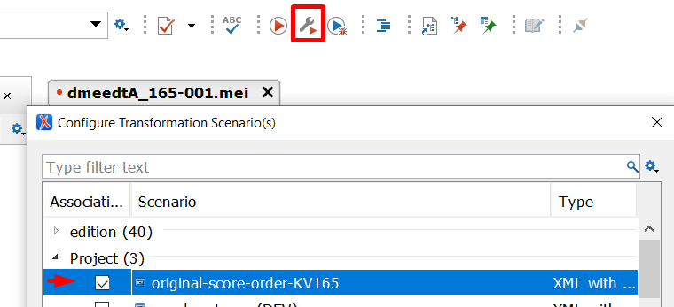

# Original Score Order of KV 165


This repository contains the MEI encoding of the [Exsultate, jubilate](https://kv.mozarteum.at/de/work/exsultate-jubilate-2625), KV 165 (first and fourth movements) by W. A. Mozart and a transformation tool that changes the score order. The encodings and the tool were developed in the context of the [Digital Mozart Edition](dme.mozarteum.at) (DME), a long-term research and editing project of the International Mozarteum Foundation (Salzburg, Austria) and the Packard Humanities Institute (Los Altos, USA).


- [Introduction](#introduction)
- [Installation and Usage](#installation-and-usage)
- [Developing](#developing)


## Introduction

The MEI files are encoded using the _Neue Mozart Ausgabe_ as a reference source, which uses the standard score order (see the image on the left). The transformation changes the score order to the one originally used by the composer.

The differences in the score order are as follows:

- the order of winds and strings is swapped
- the _Soprano_ part has a different clef
- the oboe parts are split onto two staves in the Autograph


<hr>

DME has developed a tool that transforms the standard score order to the original score order. The process consists of the following steps:

2. Replacing the `<scoreDef>` element and reordering the staves.
3. Splitting oboe parts.


## Installation and Usage

The transformation tool is implemented in XSLT. For users of the oXygen XML Editor, the repository includes a project file named `original_scoring.xpr`, which can be opened either by double-clicking it in the file explorer or by selecting it from the project view within the oXygen XML Editor.

After opening the project, you can apply the transformation scenario `original-scoring-KV165` to the files located in `./mei/source` folder.




This will output transformed MEI files to the `./mei/source/output` folder.

<hr>

Alternatively, you can use the free saxonJS processor using the command line. First you need to install nodeJS. Then run the following commands from the root of the repository.

```bash
# Install packages
npm i
```

```
# Run transformation
# Replace <movementNo> by '1' or '4' depending which movement of KV 165 you want to process.
node .\original_scoring.js <movementNo>
```

# Developing

The pipeline consists of two distinct XSLT transformations:

1. `reorder_staves`
2. `extract-parts`

The folder `./dist`contains compiled files for these transformations that can be used with the Saxon processor. The folder `./dist/xsef` contains files for use with the Java version of the Saxon and the folder `./dist/sef` contains files for use with saxonJS.

THe source files are located in the following folders:

1.  `./reorder_staves`                        
2. `./Extract-Parts` (as submodule)

Note that development takes place in an internal GitLab repository, and the GithUb serves only as a publishing platform.

